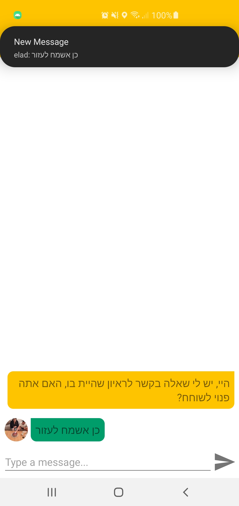
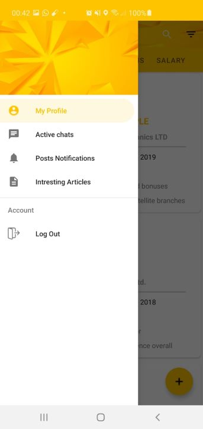

# InterViewTime

 Social network application which is designed to help people who are looking for a job to
succeed in work interviews. This can be done by allowing people to share their
experience at job interviews in different companies, and also share the questions asked
in those interviews. the app is written in Java (using Android Studio). Server side used
Firebase(Realtime, Database Storage, FCN, Authentication).Google API.

<a href ="https://www.youtube.com/watch?v=tlrIC_0oBko&ab_channel=%D7%A9%D7%99%D7%A8%D7%90%D7%A1%D7%A3">Video for the app</a>

   
     

